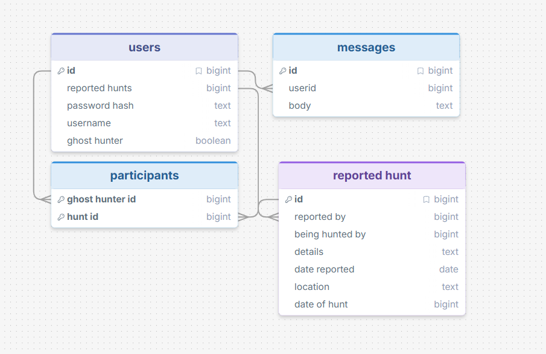
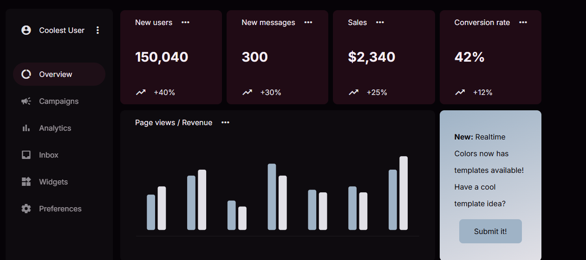
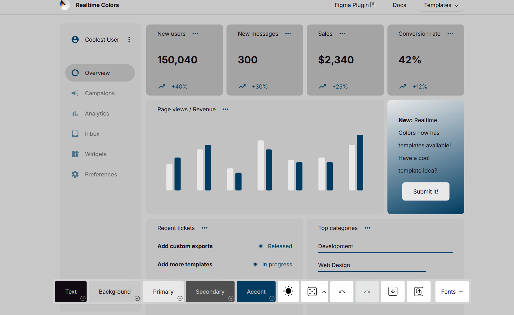
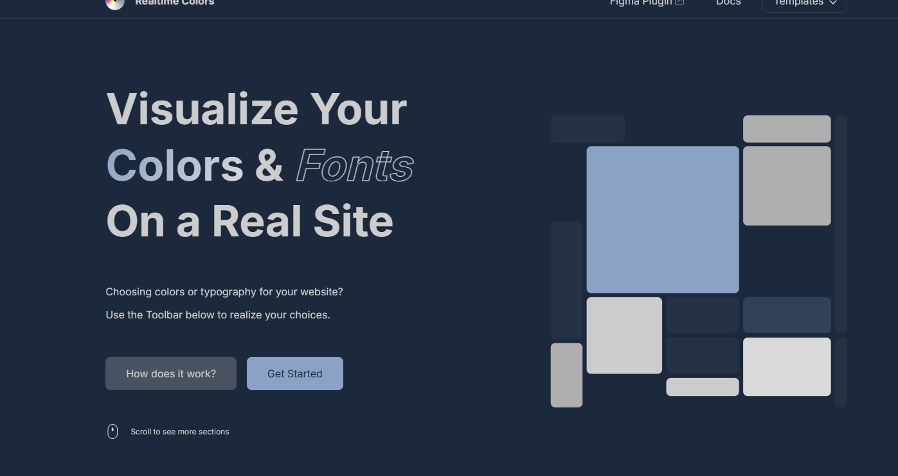
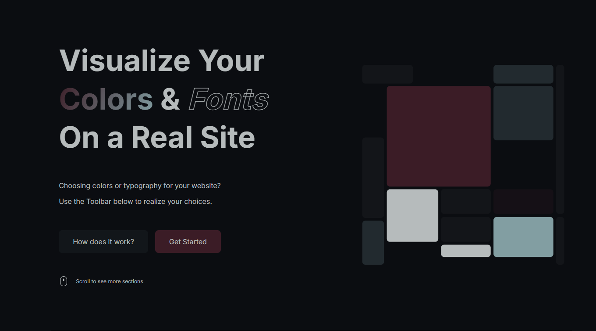

# Sprint 1 - Developing a DB and UI Prototype

## Sprint Goals

Develop a design for the database and a UI prototype that simulates the key functionality of the system. Test and refine the UI so that it can serve as the model for the next phase of development in Sprint 2.

### Specific Goals

- Design the database:
    - Tables
    - Fields / types
    - Primary keys
    - Default / nullable values
    - Relationships (foreign keys)
- Design the UI
    - Key pages
    - User interactions and 'flow'
    - Page layouts / features
    - Colour palette
    - Etc.

## Initial Database Design

This is the initial database design. It includes a table for users with an optional flare of ghost hunter, a table for each reported ghost sighting/reported ghost hunt, and a joint table for the ghost hunter id and the hunt ID.

### Required Data Input

Data that will be input may include users name, email, and password. It will also include the location in which the ghost sighting ocurred, and some basic information about the sighting.  

### Required Data Output

Relevant ghost sightings near the ghost hunter will be required, including names of other ghost hunters going on the hunt, dates, and basic information about the ghost hunt.  

### Required Data Processing

Co-ordinates given of the sighting will be fed into a map and displayed on the home page of my sight. 

## UI 'Flow'

The first stage of prototyping was to explore how the UI might 'flow' between states, based on the required functionality.

This PenPot demo shows the initial design for the UI 'flow':

[design 1](https://design.penpot.app/#/view?file-id=f0485fb1-4e63-8165-8008-39081ea26c2a&page-id=f0485fb1-4e63-8165-8008-39081ea26c2b&section=interactions&index=0&share-id=6956fb43-d0b4-807f-8008-4215dfe5d5fe)

### Testing

I showed this design to some potential end users, and they said they liked the flow, but would like an easier way to look through all the locations, and potentially a way to search through the ghost sightings. 

### Changes / Improvements

I implemented a list below the map of haunted locations/ghost sightings for the user to scroll through, plus a search function to jump to locations near them. 

report ghosts from home page. 

[Version 2](https://design.penpot.app/#/view?file-id=6956fb43-d0b4-807f-8008-4222690357ef&page-id=f0485fb1-4e63-8165-8008-39081ea26c2b&section=interactions&index=0&share-id=6956fb43-d0b4-807f-8008-4222df278f3b)

### Further Testing

Bringing this new design to the end users, they pointed out that you could not report a ghost once logged in. 
They also mentioned it would be nice to access information about a specific hunt without going through the responding page. 

### Changes / Improvements

I implemented a list below the map of haunted locations/ghost sightings for the user to scroll through, plus a search function to jump to locations near them. 

[Version 3](https://design.penpot.app/#/view?file-id=6956fb43-d0b4-807f-8008-4225282b186b&page-id=f0485fb1-4e63-8165-8008-39081ea26c2b&section=interactions&index=0&share-id=6956fb43-d0b4-807f-8008-422b49b86db4)

I brought this design to the end users, who said it looked good. 

## Initial UI Prototype

The next stage of prototyping was to develop the layout for each screen of the UI.

This penpot demo shows the initial layout design for the UI:

[Initial Ui Prototype](https://design.penpot.app/#/view?file-id=ea22f50a-78c1-8124-8008-446e65d52cb1&page-id=f0485fb1-4e63-8165-8008-39081ea26c2b&section=interactions&index=0&share-id=64054412-1123-81ed-8008-5d1bb803ef5b)

### Testing

This design was presented to the end users. They said whilst the design was very good, some elements felt crammed.

### Changes / Improvements

To combat the tight menus, I separated them into a navigation bar at the bottom of the screen. In the information tab, I also placed the important dates into a different box. 
After presenting this to the end users, they said they liked the design. 

## Refined UI Prototype

Having established the layout of the UI screens, the prototype was refined visually, in terms of colour, fonts, etc.

### Testing & Improvements on the colour scheme

I presented a selection of four colour palettes to the end users, and took feedback from the results. 

The users said they liked this colour scheme. 

The users mentioned this colour scheme was too grey. 

Some of the users liked this colour scheme, but some found it lacked variety.

The users all liked this colour scheme, but the background was a bit dark.

I then offered two more colour schemes to the users, scheme 4 with a lighter background, and a new green scheme. 

After going back and fourth on saturations, the end users settled on this scheme for the website. 

I then placed the colour scheme on the figma demo for the website, and asked the end users for their opinion again. 

The end users mentioned the red on the bottom bar was too hard to see. I replaced the red with blue, and took it back. 

The end users said they liked this design. 

## Sprint Review

This sprint went well. The end users provided clear feedback, and we managed to promptly decide on a colour scheme that matched the general ghost hunting feel. 
